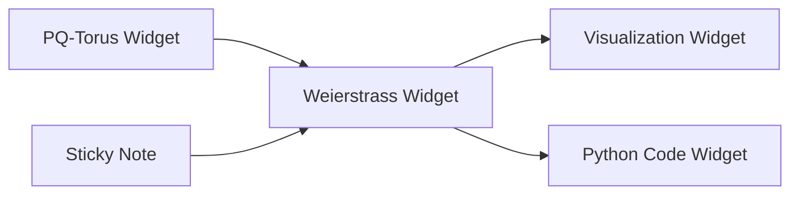

# Weierstrass ℘ Playground

**Interactive visualization of the Weierstrass ℘ function running entirely in your browser**

**🚀 [Try it now: https://litlfred.github.io/notebooks/](https://litlfred.github.io/notebooks/)**

- **Zero Installation**: Works immediately in any modern web browser
- **Powered by Pyodide**: Full Python + NumPy + Matplotlib running via WebAssembly
- **Mobile Friendly**: Responsive design works on phones and tablets
- **Dynamic Visualizations**: Re-renders when browser is resized

## Features

- **Interactive parameter controls** with real-time visual feedback
- **Multiple visualization modes**: Two-panel and time-series layouts
- **Time-series visualization**: Shows Re(℘(z(t))) and Im(℘(z(t))) vs time
- **Particle trajectory integration** following z''(t) = -℘(z(t)) * z(t)
- **Lattice trajectory visualization** option for exploring periodic structure
- **Dynamic rendering** with visual indicators during re-computation
- **PNG export** functionality for high-quality visualizations
- **Comprehensive help system** with mathematical background

## Mathematical Background

The Weierstrass ℘ function is implemented using a truncated lattice sum:

℘(z) = 1/z² + Σ[1/(z-ω)² - 1/ω²]

where the sum runs over non-zero lattice points ω ∈ Λ = ℤp + ℤiq within truncation bound N.

**Particle trajectories** follow the second-order differential equation:
**z''(t) = -℘(z(t)) * z(t)**

Integration uses RK4 method with automatic blow-up detection near poles.

## Quick Start

1. Visit https://litlfred.github.io/notebooks/
2. Wait for Pyodide to load (~30 seconds first time)
3. Try default settings: p=11, q=5, N=3
4. Click "Render" to generate visualization
5. Experiment with different particles: z₀ = `5+2j`, v₀ = `0+1j`
6. Resize your browser window to see dynamic re-rendering

## Repository Structure

This repository contains a comprehensive widget framework for interactive mathematical computing:

```
├── src/weierstrass_playground/    # Main Python package (legacy - for reference)
├── libraries/                    # New Widget Framework Libraries
│   ├── core/                    # Core widgets & shared functionality
│   │   ├── base_widget.py       # Enhanced WidgetExecutor base class
│   │   ├── sticky-note/         # Sticky note widgets
│   │   ├── python-code/         # Python execution widgets
│   │   └── arrow/               # ETL arrow transformation widgets
│   └── pq-torus/                # Mathematical widget library
│       ├── pq_torus.py          # PQ-Torus parameter widget
│       └── weierstrass/         # Weierstrass ℘-function widgets
│           ├── two-panel/       # Two-panel visualization
│           ├── three-panel/     # Three-panel visualization
│           ├── five-panel/      # Five-panel visualization
│           └── trajectories/    # Trajectory widgets
├── docs/                        # Widget framework & GitHub Pages
│   ├── index.html              # Main web interface  
│   ├── weierstrass-playground/ # Interactive blackboard system
│   │   ├── board.html          # Widget blackboard interface
│   │   └── widget-schemas.json # Widget registry
│   └── widget-overview.md      # Complete framework documentation
├── legacy/                      # Legacy files (maintained for compatibility)
│   ├── weierstrass_lib.py      # Original library functions
│   └── setup.py                # Original package configuration
├── notebooks/                   # Example notebook implementations
└── requirements.txt            # Dependencies
```

### Widget Framework

The repository includes a complete **production-ready widget framework** for building interactive mathematical computing environments:

- **🎯 Schema-Based Design**: JSON Schema validation with named, reusable schemas hosted on GitHub Pages
- **🔗 JSON-LD & PROV-O Integration**: Full provenance tracking for computational workflows and mathematical dependencies
- **🧩 Visual Programming Interface**: Drag-and-drop widget blackboard with dependency management between widgets
- **📊 Mathematical Focus**: Specialized widgets for computational mathematics (lattice theory, complex analysis, etc.)
- **🌐 Zero-Install Deployment**: All schemas accessible via HTTPS URLs, works entirely in browser via Pyodide
- **🔄 Extensible Architecture**: Six-file schema pattern (input/output/widget × JSON Schema/JSON-LD) for easy widget development

#### Available Widgets

The framework provides several specialized mathematical widgets:

- **📝 Sticky Note**: Markdown content widgets with LaTeX support for mathematical annotations
- **🔴 PQ-Torus**: Prime lattice torus definition widgets (T = ℂ / L where L = ℤp + ℤqi) for complex analysis
- **∞ Weierstrass Functions**: ℘(z) visualization and analysis widgets for elliptic function theory
- **🐍 Python Code**: Interactive code execution widgets with full NumPy/Matplotlib support
- **📊 Data Visualization**: Advanced plotting and data generation widgets with real-time updates

#### Widget Architecture & Dependencies

The framework supports sophisticated mathematical workflows through widget dependencies and provenance tracking:



**Example Mathematical Pipeline:**
1. **PQ-Torus Widget**: Define prime lattice parameters (p=11, q=5)
2. **Weierstrass Widget**: Use parameters for ℘-function computation with lattice Λ = ℤp + ℤqi
3. **Visualization Widget**: Generate complex plane visualizations with particle trajectories
4. **Python Code Widget**: Custom analysis or parameter exploration

Each widget interaction is tracked via PROV-O provenance graphs, enabling reproducible mathematical workflows.

**🚀 [Try the widget framework: https://litlfred.github.io/notebooks/weierstrass-playground/board.html](https://litlfred.github.io/notebooks/weierstrass-playground/board.html)**

## Architecture Overview

This repository implements a **dual-system architecture** combining traditional Jupyter notebooks with an advanced widget framework:

### 1. Interactive Notebooks 📓

**Four-File Pattern**: Each notebook follows a modular architecture for maintainability and reusability:

```
notebook_name.ipynb          # MINIMAL notebook (imports + UI display only)
notebook_name_lib.py         # Mathematical/computational logic  
notebook_name_ui.py          # UI widgets and layout code
notebook_name_preamble.py    # Documentation and setup (optional)
```

**Key Benefits:**
- **Separation of Concerns**: Math logic separated from UI code
- **Reusable Components**: Library functions can be imported by other notebooks
- **Clean Notebooks**: Jupyter files contain only essential display code
- **Testable Code**: Mathematical functions can be unit tested independently

### 2. Widget Framework 🧩

**Schema-Driven Architecture**: Production-ready system for building complex mathematical workflows:

```
docs/schema/{widget-name}/
├── input.schema.json        # JSON Schema for input validation
├── input.jsonld            # JSON-LD context for semantic web
├── output.schema.json      # JSON Schema for output validation  
├── output.jsonld           # JSON-LD context for provenance
├── widget.schema.json      # Widget instance configuration
└── widget.jsonld           # Widget semantic definition
```

**Key Features:**
- **GitHub Pages Integration**: All schemas served as HTTPS URLs
- **PROV-O Compliance**: Full provenance tracking for computational workflows
- **Dependency Management**: Widgets can consume outputs from other widgets
- **Type Safety**: JSON Schema validation for all inputs and outputs

### Integration

Both systems work together seamlessly:
- **Notebooks** provide exploratory mathematical environments
- **Widget Framework** enables building reusable, shareable mathematical tools
- **Shared Libraries**: Common mathematical functions used by both systems
- **Browser Deployment**: Both run entirely in browser via Pyodide + WebAssembly


### Package Installation

Install the Python package locally:
```bash
# Development installation
pip install -e .

# Or install from PyPI (when published)
pip install weierstrass-playground
```

### Python Usage

```python
import weierstrass_playground as wp

# Basic function evaluation
z = 2.0 + 1.5j
p, q, N = 11.0, 5.0, 3
wp_val = wp.wp_rect(z, p, q, N)

# Create visualization
fig = wp.browser.create_complete_visualization(
    mode='two_panel', p=p, q=q, N=N, 
    nx=100, ny=100, particles=[(5+0j, 0+1j)], 
    # ... other parameters
)
```

## Development

### Getting Started

For local development and contributions:

```bash
# Clone repository
git clone https://github.com/litlfred/notebooks.git
cd notebooks

# Install dependencies
pip install -r requirements.txt

# Run local development server
cd docs
python -m http.server 8000
# Visit http://localhost:8000
```

### Documentation and Contribution Guidelines

- **[`CONTRIBUTING.md`](CONTRIBUTING.md)** - Complete contribution workflow, branch naming conventions, and development standards
- **[`.github/copilot-instructions.md`](.github/copilot-instructions.md)** - AI agent and Copilot-specific guidelines
- **[`docs/widget-overview.md`](docs/widget-overview.md)** - Comprehensive widget framework documentation
- **[`docs/schema/README.md`](docs/schema/README.md)** - JSON Schema and JSON-LD technical specifications

### Repository Structure

For detailed technical information, see the comprehensive documentation linked above. The repository maintains high code quality standards with extensive testing, modular architecture, and clear separation between mathematical logic, UI components, and configuration.
