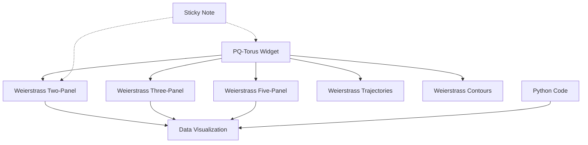

# Widget Framework Overview

The notebooks repository includes a comprehensive widget framework for building interactive mathematical computing environments. This document provides an overview of all available widgets and their schemas.

## Framework Architecture

The widget framework uses a directory-based schema organization with JSON-LD integration for provenance tracking:

```
docs/schema/
├── ontology/context.jsonld        # Shared JSON-LD vocabulary
├── common/                        # Shared schemas
├── weierstrass/                   # Weierstrass ℘ function widgets  
├── pq-torus/                      # Prime lattice torus widgets
├── sticky-note/                   # Markdown note widgets
└── example-notebook-graph.jsonld # PROV-O workflow example
```

## Available Widgets

### 1. Sticky Note Widget 📝

**Purpose**: Simple markdown content widget for documentation and notes

**Schema**: `https://litlfred.github.io/notebooks/schema/sticky-note/`

**Input**:
- `content`: Markdown content (default: "# New Note\n\nEdit to add content...")
- `show_note`: Whether to show note by default (boolean, default: true)
- `title`: Optional note title (default: "Sticky Note")
- `background_color`: Note background color (default: "#fff3cd")

**Output**:
- `rendered_html`: HTML rendered from markdown
- `markdown_content`: Original markdown content
- `metadata`: Word count, character count, markdown features

**Use Cases**:
- Documentation within computational workflows
- Mathematical explanations with LaTeX support
- Annotations for complex calculations

### 2. PQ-Torus Widget 🔴

**Purpose**: Defines torus T = ℂ / L where L = ℤp + ℤqi with prime lattice parameters

**Schema**: `https://litlfred.github.io/notebooks/schema/pq-torus/`

**Input**:
- `p`: First prime integer (2-100, default: 11)
- `q`: Second prime integer (2-100, default: 5)

**Output**:
- `p`, `q`: Validated prime parameters
- `torus_description`: Mathematical description "T = ℂ / L where L = ℤ11 + ℤ5i"
- `lattice_description`: Lattice structure description
- `prime_validation`: Validation status for both parameters
- `markdown_content`: Rich mathematical documentation

**Use Cases**:
- Parameter source for Weierstrass function analysis
- Prime number lattice research
- Mathematical torus visualization setup

**Dependencies**: Serves as input to all Weierstrass widgets

### 3. Weierstrass Function Widgets ∞

**Purpose**: Visualization and analysis of Weierstrass ℘ functions

**Schema**: `https://litlfred.github.io/notebooks/schema/weierstrass/`

**Input**:
- `p`: Lattice parameter p (0.1-20, default: 11.0)  
- `q`: Lattice parameter q (0.1-20, default: 5.0)
- `N`: Truncation level (0-6, default: 3)
- `grid_size`: Computation grid dimensions (default: 100x100)

**Output**:
- `plot_data`: Generated visualization (base64 image, width, height)
- `field_data`: ℘(z) field data and analysis points
- `metadata`: Lattice parameters, computation method, widget instance

**Widget Types**:
- `wp-two-panel`: ℘(z) and ℘′(z) visualization
- `wp-three-panel`: ℘(z), Re(℘′(z)), Im(℘′(z)) analysis
- `wp-five-panel`: Complete field analysis with derivatives
- `wp-trajectories`: Particle trajectory integration
- `wp-contours`: Topographic contour mapping

**Dependencies**: Can receive parameters from PQ-Torus widgets

### 4. Python Code Widget 🐍

**Purpose**: Interactive Python code execution within mathematical workflows

**Schema**: `https://litlfred.github.io/notebooks/schema/python-code/` (can be created following the pattern)

**Input**:
- `code`: Python code to execute
- `imports`: Required import statements
- `variables`: Input variables for code execution

**Output**:
- `result`: Execution result
- `stdout`: Standard output
- `stderr`: Error output
- `execution_time`: Performance metrics

**Use Cases**:
- Custom mathematical computations
- Data transformation between widgets
- Algorithm prototyping and testing

### 5. Data Visualization Widget 📊

**Purpose**: Plotting and data generation for mathematical analysis

**Schema**: `https://litlfred.github.io/notebooks/schema/data-visualization/` (can be created)

**Input**:
- `data`: Input data arrays
- `plot_type`: Visualization type (scatter, line, histogram, etc.)
- `styling`: Colors, labels, formatting options

**Output**:
- `plot_data`: Generated visualization
- `statistics`: Data analysis summary
- `metadata`: Plot configuration and parameters

## Widget Relationships

The framework supports complex dependency relationships:



## Schema URLs and GitHub Pages

All schemas are accessible via GitHub Pages:

| Widget | Base URL |
|--------|----------|
| Common | `https://litlfred.github.io/notebooks/schema/common/` |
| Ontology | `https://litlfred.github.io/notebooks/schema/ontology/` |
| Sticky Note | `https://litlfred.github.io/notebooks/schema/sticky-note/` |
| PQ-Torus | `https://litlfred.github.io/notebooks/schema/pq-torus/` |
| Weierstrass | `https://litlfred.github.io/notebooks/schema/weierstrass/` |

Each widget directory contains:
- `input.schema.json` - Input validation schema
- `input.jsonld` - Input JSON-LD context
- `output.schema.json` - Output validation schema
- `output.jsonld` - Output JSON-LD context
- `widget.schema.json` - Widget instance schema
- `widget.jsonld` - Widget instance context

## PROV-O Integration

The framework supports full provenance tracking using PROV-O:

```json
{
  "@context": [
    "https://www.w3.org/ns/prov-o.jsonld",
    "https://litlfred.github.io/notebooks/schema/ontology/context.jsonld"
  ],
  "@graph": [
    {
      "@id": "urn:uuid:pq-torus-widget-1",
      "@type": ["prov:Entity", "pqt:widget"],
      "widget_type": "pq-torus",
      "input": {"p": 11, "q": 5}
    },
    {
      "@id": "urn:uuid:weierstrass-widget-1",
      "@type": ["prov:Entity", "weier:widget"], 
      "widget_type": "wp-two-panel",
      "dependencies": [
        {
          "source_widget": "urn:uuid:pq-torus-widget-1",
          "source_path": "p",
          "target_path": "p"
        }
      ]
    }
  ]
}
```

## Interactive Blackboard

The widget framework includes a visual programming interface:

🚀 **[Try the interactive blackboard](https://litlfred.github.io/notebooks/weierstrass-playground/board.html)**

Features:
- Drag-and-drop widget placement
- Visual dependency connections
- Real-time execution with status indicators
- Schema-based configuration forms
- Export capabilities for workflows

## Development Guidelines

### Adding New Widgets

1. Create widget directory: `docs/schema/{widget-name}/`
2. Create 6 required files (input/output/widget × schema.json/jsonld)
3. Update ontology context with widget prefix
4. Add widget to registry: `docs/weierstrass-playground/widget-schemas.json`
5. Implement Python backend: `docs/weierstrass-playground/widgets/{widget}.py`
6. Test all URLs resolve via GitHub Pages

### Schema Requirements

- Use GitHub Pages URLs: `https://litlfred.github.io/notebooks/schema/`
- Include PROV-O compatibility: `"@type": ["prov:Entity", "{prefix}:{type}"]`
- Reference schemas: `"dct:conformsTo": "./input.schema.json"`
- Follow JSON Schema Draft 7 specification

## Next Steps

The widget framework provides a solid foundation for:

- **Research Workflows**: Complex mathematical analysis pipelines
- **Educational Tools**: Interactive mathematical exploration
- **Collaborative Computing**: Shareable computational notebooks with provenance
- **Reproducible Research**: Full dependency tracking and schema validation

See the complete documentation in:
- `docs/widget-framework.md` - Full framework documentation
- `docs/json-schema-specification.md` - Schema specifications  
- `docs/architecture-examples.md` - Implementation examples
- `docs/migration-guide.md` - Migration strategy